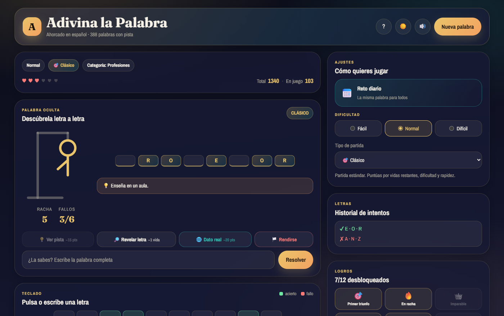

# 🧠 Adivina la Palabra

Juego del ahorcado en español, hecho con **HTML, CSS y JavaScript puro**: sin frameworks, sin build, sin dependencias. Se abre y se juega.

**▶️ Jugar: [buscapalabra.vercel.app](https://buscapalabra.vercel.app/)**



---

## ✨ Qué tiene

**Jugabilidad**

- **388 palabras** en 16 categorías, cada una con su definición como pista.
- **3 dificultades** que cambian la longitud de la palabra y las vidas: Fácil (≤5 letras, 8 vidas), Normal (6–8, 6 vidas), Difícil (9+, 5 vidas).
- **5 modos de partida**: Clásico, Contrarreloj, Letras quemadas, Multiplicador y Práctica.
- **Reto diario**: la misma palabra para todo el mundo, generada con una semilla determinista a partir de la fecha. Solo puntúa el primer intento del día.
- **Sistema de pistas** de tres niveles: la definición cuesta 15 puntos, el dato de Wikipedia 20, y revelar una letra cuesta una vida.
- **Datos reales de Wikipedia**: si la palabra tiene artículo, puedes pedirlo como pista con la palabra tapada (`La ▁▁▁▁ u oliva es el fruto del olivo…`), y al terminar lo ves entero con foto y enlace.
- **Resolver la palabra entera** si la intuyes antes de tiempo. Fallar cuesta una vida.
- **12 logros** desbloqueables y estadísticas persistentes (racha, mejor racha, mejor tiempo, % de acierto, historial).
- **Compartir resultado** en formato emoji, al portapapeles con un clic.

**Interfaz**

- Teclado **QWERTY** en pantalla con estado por tecla: acierto, fallo o quemada.
- Tema **claro y oscuro**, que arranca respetando la preferencia del sistema.
- Ahorcado en SVG que se dibuja proporcionalmente a las vidas de la dificultad.
- Efectos de sonido sintetizados con la Web Audio API, sin archivos de audio.
- Diseño adaptable de 360 px a escritorio, sin scroll horizontal en ningún ancho.

**Accesibilidad**

- Navegable por teclado de principio a fin, con indicadores de foco visibles.
- Región `aria-live` que anuncia el estado de la palabra a los lectores de pantalla.
- Cada tecla, logro y control tiene su etiqueta accesible.
- Respeta `prefers-reduced-motion`: desactiva confeti y animaciones.

---

## 🔌 Banco local + API: cómo encajan

El juego usa **las dos cosas a la vez**, pero con papeles bien separados:

| | Banco local (`words.js`) | Wikipedia ES |
|---|---|---|
| **Papel** | Elige la palabra secreta | Añade contexto sobre ella |
| **Aporta** | Palabra, categoría, definición | Extracto real, foto, enlace |
| **Si falla** | No puede fallar | El juego sigue igual, sin el extra |

La API **nunca decide qué palabra toca**. Esa inversión es lo que hace que el reto diario pueda ser idéntico para todo el mundo, que las dificultades sigan cuadrando y que el juego funcione entero sin conexión.

```
ronda nueva
   ├─ banco local  ──► palabra + categoría + pista   (instantáneo, siempre)
   └─ fetch Wikipedia ──► extracto + foto + enlace   (en segundo plano, opcional)
                           │
                           ├─ 200 y artículo válido ──► aparece el botón "Dato real"
                           └─ 404 / desambiguación / timeout / sin red ──► no aparece nada
```

Detalles de la integración:

- **Endpoint**: `es.wikipedia.org/api/rest_v1/page/summary/{palabra}`, que responde con CORS abierto (funciona incluso abriendo el `index.html` con `file://`).
- **Nunca bloquea**: la petición sale después de que la ronda ya sea jugable, con `AbortController` y 6 s de límite.
- **Censura automática**: antes de mostrar el extracto durante la partida se tapa la palabra y sus derivados recortando la raíz, así que los plurales también caen. Prefiere tapar de más a destripar la respuesta.
- **Caché en `localStorage`** durante 30 días, incluidos los fallos, para no repetir peticiones. Máximo 150 entradas.
- **Se descarta** todo lo que no sea un artículo de verdad: desambiguaciones, respuestas sin extracto y errores.
- **Privacidad**: al pedir el dato se envía la palabra de la ronda a Wikipedia. Nada más, y nunca datos tuyos.

---

## 🎮 Cómo se juega

Escribe con tu teclado o pulsa el teclado en pantalla. No hace falta poner acentos (la **Ñ** sí es una letra aparte). Descubre la palabra antes de quedarte sin vidas.

| Modo | Qué cambia |
|------|-----------|
| 🎯 **Clásico** | Partida estándar. Puntúas por vidas restantes, dificultad y rapidez. |
| ⏱️ **Contrarreloj** | 60–90 s según dificultad. Si el reloj llega a cero, pierdes. |
| 🔥 **Letras quemadas** | Cada fallo quema además una letra al azar (nunca una que necesites). |
| ✖️ **Multiplicador** | Cada acierto seguido sube el multiplicador hasta ×3. Un fallo lo reinicia. |
| 🧪 **Práctica** | Fallos ilimitados. No puntúa ni cuenta en las estadísticas. |

### Cómo se calculan los puntos

```
(letras únicas × 4  +  bonus de dificultad  +  vidas restantes × 5  +  bonus de rapidez)
    × multiplicador  −  penalización por pistas
```

---

## 🛠️ Cómo ejecutarlo

No hay nada que instalar ni compilar.

```bash
git clone https://github.com/Chijopana/Buscapalabra
cd Buscapalabra
```

Luego abre `index.html` en el navegador. También funciona servido:

```bash
python -m http.server 8000   # http://localhost:8000
```

---

## 📁 Estructura

```
.
├── index.html              # Estructura y semántica
├── assets/
│   ├── css/styles.css      # Tokens de diseño, componentes y responsive
│   ├── js/words.js         # Banco de palabras (palabra, categoría, pista)
│   ├── js/main.js          # Motor del juego
│   └── img/preview.png
└── README.md
```

---

## 🧩 Decisiones de diseño

- **La dificultad se deriva, no se declara.** El banco de palabras solo guarda palabra, categoría y pista; el número de letras decide en qué dificultad cae. Así es imposible que una palabra quede etiquetada como "fácil" y tenga 14 letras.
- **Scripts clásicos en lugar de módulos ES.** Permite abrir `index.html` con `file://` sin montar un servidor, que es cómo la mayoría de la gente prueba un proyecto que acaba de clonar.
- **El modo Práctica no puntúa.** Con fallos ilimitados siempre acabas ganando, así que contarlo en las estadísticas las vaciaría de sentido.
- **Las letras quemadas nunca son necesarias.** El modo elige solo entre letras que no están en la palabra: castigar sin hacer la partida imposible.
- **El estado vive en un solo objeto** y el render es una función de ese estado, sin leer nunca el DOM para saber qué está pasando.
- **Sin dependencias.** Todo —sonido, confeti, generador determinista, persistencia, caché— es código propio.
- **La API enriquece, no manda.** Es la diferencia entre "el juego se rompe si el servicio cae" y "el juego pierde un adorno si el servicio cae". La versión anterior de este proyecto apuntaba a tres APIs de Heroku que llevaban muertas desde 2022; el flag que las activaba estaba fijo en `false`, así que nunca llegó a notarse.

---

## 🧠 Qué aprendí con este proyecto

- Separar el estado del juego de su representación, y descubrir que las animaciones y el render se vuelven triviales cuando esa frontera está clara.
- Los detalles de accesibilidad que no se ven: por qué una cuadrícula de letras necesita una región `aria-live` aparte, y por qué `* { margin: 0 }` rompe el centrado nativo de `<dialog>`.
- Web Audio API: que un oscilador sin rampa de ganancia suena a "clic", y que hay que reutilizar un único `AudioContext` en lugar de crear uno por nota.
- Generadores pseudoaleatorios con semilla, para que el reto diario dé la misma palabra a todo el mundo sin necesidad de servidor.
- Que `localStorage` puede lanzar excepciones (modo privado, cuota llena) y que un juego no debería romperse por eso.
- Cómo integrar una API de terceros sin volverse dependiente de ella: timeout, caché, degradación silenciosa y una frontera clara sobre qué decide cada parte.
- Que Wikimedia exige `User-Agent` en sus APIs y devuelve HTML de error si no lo mandas — desde el navegador no es problema, pero probándolo con `curl` te vuelve loco.

---

## 📄 Licencia

MIT — ver [LICENSE](LICENSE).
